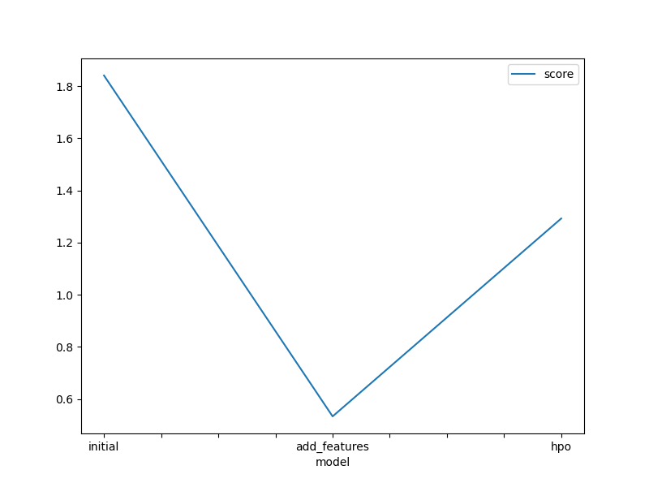
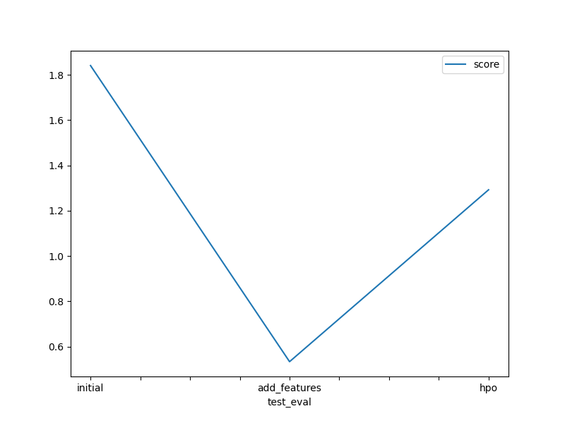

# Report: Predict Bike Sharing Demand with AutoGluon Solution
#### NAME HERE

## Initial Training
### What did you realize when you tried to submit your predictions? What changes were needed to the output of the predictor to submit your results?
Initially, the predictions from the model included negative values, which are not valid for the "count" column in the Kaggle submission. Therefore, before submitting, we had to clip or replace negative predictions with zero using predictions = predictions.clip(lower=0) to ensure the submission was accepted and accurate.

### What was the top ranked model that performed?
From the initial training, the top-ranked model identified by AutoGluon was LightGBM, which is a gradient boosting framework that is well-suited for regression tasks on structured data like this one.

## Exploratory data analysis and feature creation
### What did the exploratory analysis find and how did you add additional features?
Exploratory analysis revealed that bike demand varied significantly based on the hour of the day. To capture this pattern, we extracted the hour feature from the datetime column. We also converted season and weather columns to categorical types so AutoGluon could treat them as categories rather than numerical values, which improved feature interpretation.

### How much better did your model preform after adding additional features and why do you think that is?
After adding new features like hour and converting some numerical columns to categorical, the model's Kaggle score improved significantly from 1.84142 to 0.53304. These improvements helped the model capture temporal and seasonal variations more effectively, which are key drivers of bike demand.

## Hyper parameter tuning
### How much better did your model preform after trying different hyper parameters?
With hyperparameter tuning, the Kaggle score changed from 0.53304 (after feature addition) to 1.29259. While this was a regression in performance on the leaderboard, it highlights the importance of using proper validation strategies and possibly longer training times for better results. It's likely the tuning overfit to the training data or was constrained by the time limit.

### If you were given more time with this dataset, where do you think you would spend more time?
If more time were available, I would:
Perform more comprehensive feature engineering (e.g., interaction terms, weather bucketization).
Extend hyperparameter tuning time and use more advanced search methods.
Investigate ensembling multiple top models.
Try using external datasets (e.g., holidays, events) to enrich the features.

### Create a table with the models you ran, the hyperparameters modified, and the kaggle score.
|model|hpo1|hpo2|hpo3|score|
|--|--|--|--|--|
|initial|default|default|default|1.84142|
|add_features|default|default|default|0.53304|
|hpo|learning_rate, activation|num_leaves|dropout_prob|1.29259|

### Create a line plot showing the top model score for the three (or more) training runs during the project.

### Create a line plot showing the top kaggle score for the three (or more) prediction submissions during the project.

## Summary
This project explored the application of AutoGluon for predicting bike-sharing demand using a tabular dataset. We started with a simple model, then enhanced it with key time-based and categorical features which dramatically improved the performance. Although hyperparameter tuning did not yield better Kaggle scores due to time and validation limitations, it provided insights into model behavior and optimization techniques. With additional time, further refinement in feature engineering and tuning strategy would likely lead to even better performance.
