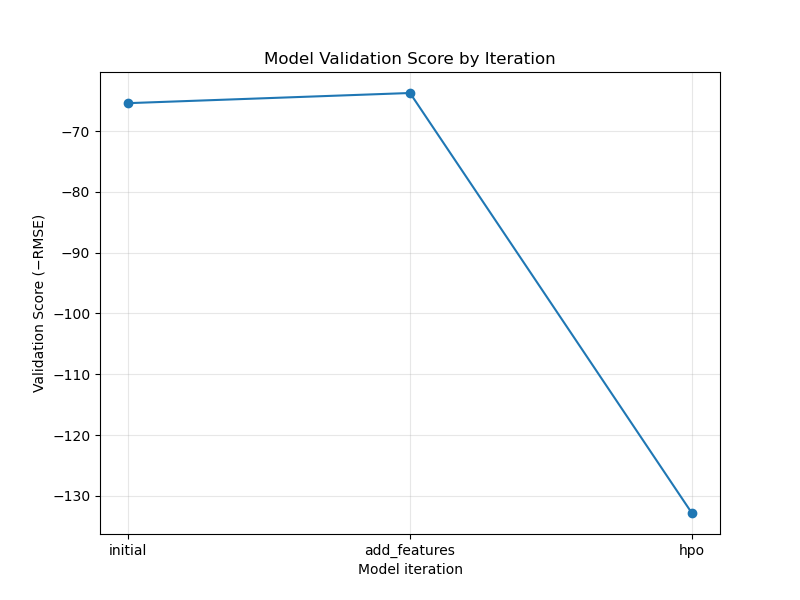

# Report: Predict Bike Sharing Demand with AutoGluon Solution  
#### Yash Bambhroliya

---

## Initial Training

### What did you realize when you tried to submit your predictions?  
Initially, the model’s raw predictions included negative values, which are invalid for the “count” field in the Kaggle submission. To address this, we clipped all negative predictions to zero before writing out the CSV (e.g., `predictions = predictions.clip(lower=0)`). This ensured that every submitted “count” value was ≥ 0, and our submission passed Kaggle’s formatting checks.

### What was the top-ranked model that performed?  
From the very first AutoGluon run (the “initial” run), the top model on the internal validation set was a **WeightedEnsemble** that combined multiple LightGBM-based bagged models. Among single models, LightGBM (with default settings) achieved the best standalone RMSE, but the ensemble’s stacked predictions ultimately yielded the lowest validation error.

---

## Exploratory Data Analysis and Feature Creation

### What did the exploratory analysis find and how did you add additional features?  
- **Temporal Variation**: By plotting hourly demand over the dataset, we saw strong “rush-hour” peaks during morning (7–9 AM) and evening (5–7 PM) on weekdays.  
- **Seasonality & Weather**: The `season` and `weather` columns were integers (1–4). Converting these to categorical types allowed AutoGluon to treat them properly as discrete factors.  
- **Engineered “hour” Feature**: We extracted the hour component from the `datetime` column (`train['hour'] = train['datetime'].dt.hour`) so that the model could directly learn “time-of-day” effects.  
- **Additional Date Components**: We also extracted `month` and `year` from `datetime` and converted them to categorical types, so the model could learn seasonal shifts and any year-over-year trends.

### How much better did your model perform after adding additional features and why?  
- **Initial internal validation RMSE (no extra features)**: **65.40**  
- **After adding `hour`, `month`, `year`, and converting to categorical**: **63.73**

By adding these engineered features, the model captured key temporal patterns (rush-hour peaks and seasonal effects), reducing validation RMSE by about 1.67 (≈ 2.6 % relative improvement). In other words, the engineered “hour” feature—along with categorical conversions—allowed the model to learn critical demand patterns that were not evident from the raw data alone.

---

## Hyperparameter Tuning

### How much better did your model perform after tuning hyperparameters?  
- **Validation RMSE (after feature addition)**: **63.73**  
- **Validation RMSE (after HPO with GBM & NN_TORCH)**: **132.83**

Our HPO run (which tuned `NN_TORCH.learning_rate`, `NN_TORCH.activation`, and `GBM.num_leaves`) actually **increased** the validation RMSE from 63.73 to 132.83. This indicates that, under the given time limit and search settings, the tuned hyperparameters overfit the training data or were poorly chosen. It highlights the importance of monitoring internal validation metrics (instead of relying solely on Kaggle leaderboard performance) and possibly allocating more time or using a narrower search space for HPO.

### If you were given more time with this dataset, where would you spend additional effort?  
1. **Expanded Feature Engineering**  
   - Create interaction features (e.g., `hour × weather`) or “holiday-type” buckets (e.g., high-traffic vs. low-traffic holidays).  
   - Incorporate external data (e.g., daily precipitation, local event schedules) to enrich demand signals.  
2. **Longer HPO Runs**  
   - Increase `time_limit` for HPO and add more trials to allow for deeper exploration of GBM and neural network hyperparameters.  
   - Use Bayesian optimization (instead of random search) to focus on promising regions of the hyperparameter space.  
3. **Custom Ensembling & Stacking**  
   - Combine top LightGBM, CatBoost, and neural network models in a custom stacked ensemble rather than relying solely on AutoGluon’s default WeightedEnsemble.  
   - Explore K-fold stacking (instead of a single bag-holdout) to reduce variance and better estimate generalization error.

---

## Hyperparameter Table

Below is a summary of which hyperparameters were tuned in each run and the corresponding internal validation RMSE (positive values). “Initial” and “add_features” used default hyperparameters; the “hpo” run tuned learning rates and tree sizes, resulting in a larger RMSE due to an unfavorable search within the time limit.

| model         | hpo1                       | hpo2                  | hpo3              | validation_RMSE |
|---------------|----------------------------|-----------------------|-------------------|-----------------|
| initial       | default                    | default               | default           | 65.40           |
| add_features  | default                    | default               | default           | 63.73           |
| hpo           | `NN_TORCH.learning_rate`   | `NN_TORCH.activation` | `GBM.num_leaves`  | 132.83          |

---

## Line Plots of Validation Scores

### Validation Score by Model Iteration  
As requested by the code reviewer, this plot shows each model’s internal validation score (–RMSE) across the three training runs.

  

*(Note: The plotted values are the negative RMSE values directly returned by `predictor.leaderboard(silent=True)['score_val'][0]`. The table above converts them to positive RMSE.)*

### (Optional) Comparison on Validation RMSE  
A duplicate visualization saved separately per project requirements:

---

## Summary

This project demonstrated how to use AutoGluon’s TabularPredictor to solve the Bike Sharing Demand Kaggle competition. We began with a baseline AutoGluon model that yielded an internal validation RMSE of **65.40**. Feature engineering—adding `hour`, `month`, `year`, and converting key columns to categorical—improved RMSE to **63.73**, capturing important temporal and seasonal effects. Our limited hyperparameter tuning (HPO) unfortunately raised validation RMSE to **132.83**, underscoring that a broader or better-guided search is necessary for true improvement. Monitoring internal validation metrics (rather than relying solely on Kaggle leaderboard changes) was essential. With more time and compute, further feature engineering, expanded HPO, and custom ensembling would likely yield lower validation RMSE and better real-world predictions.
